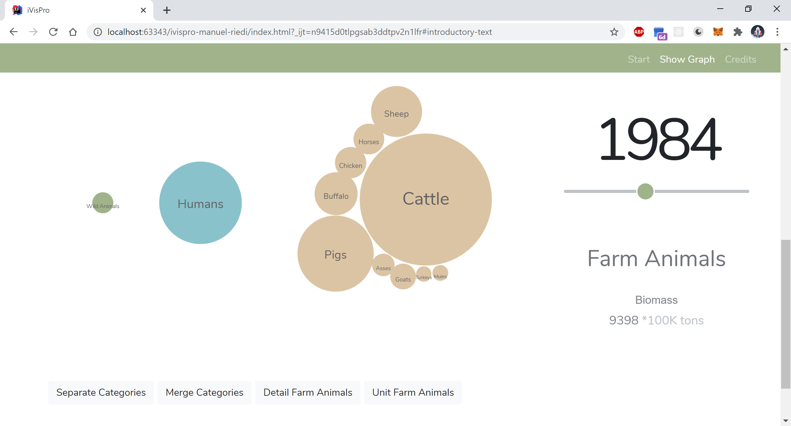

# Interactiv visualization (Project Animal_Biomass_Comparison)

## Demo Video
https://youtu.be/AXY6XKsTE5M

## Why I chose this project
In a TV show, a well-known doctor mentioned that the biomass of all wild animals is much smaller than the biomass of all farm animals in the world. This statement touched me very much, which is why I decided to bring the message of this fact to the people by implementing this in the IvisPro.

## Data acquisition and transformation
I could only find the data on farm animals and humans in a form in which the number of farm animals or humans were counted:
Livestock counts for Animal: https://ourworldindata.org/grapher/livestockcounts?time=1890..2014
Human Population: https://data.worldbank.org/indicator/sp.pop.totl
In order to be able to determine the biomass for these data, I have therefore researched the average weight of each individual farm animal and human being. The corresponding information was obtained from various internet sources. The average weight was then multiplied by the number of people and animals.
After this data transformation the numbers were much too large. Therefore, I converted them into 100K tons. 
For the biomass of wild animals (more precisely wild animals which are mammals) I had concrete figures from the following source:
Biomass of Wild Animals: https://github.com/milo-lab/biomass_distribution

## Why I chose Bubbles
The aim was to present the data in such a way that one can see as clearly as possible the proportion of quantities between the categories. In principle, a pie chart, for example, would be well suited for this purpose. However, I wanted to implement something more striking with my project. Something that would make the fact of this excessive keeping of farm animals a lasting effect on the visitors.
That's why I chose bubbles to display the data. Bubbles are also good for displaying proportions. Especially can they be used to achieve good results in terms of gamification, because they encourage playing around. For this reason, I added some functions to play around with the bubbles and so the core message of the project is better remembered.

